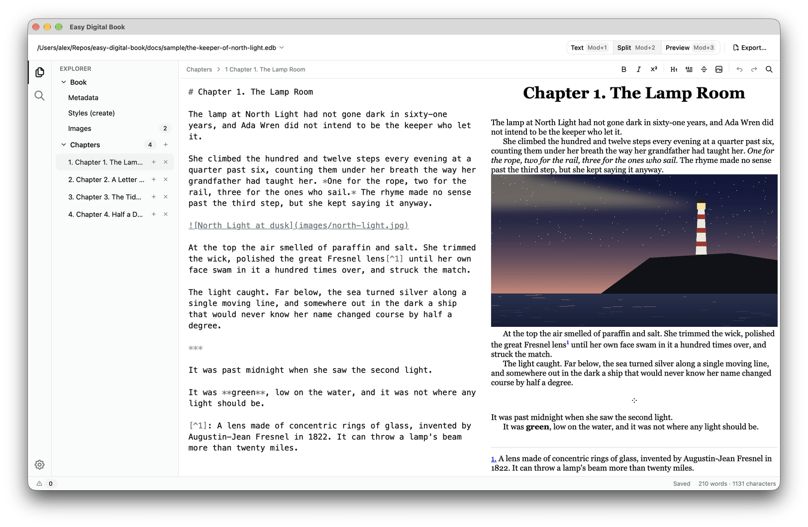
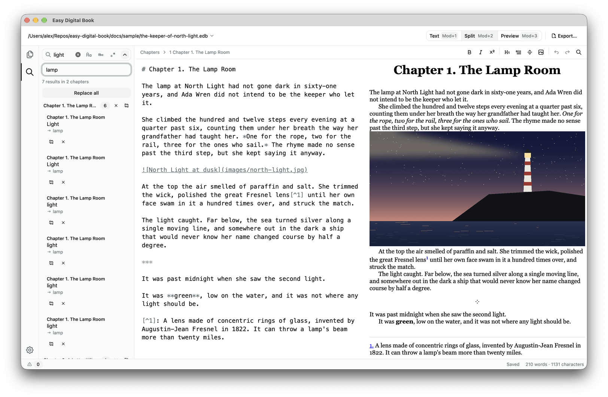
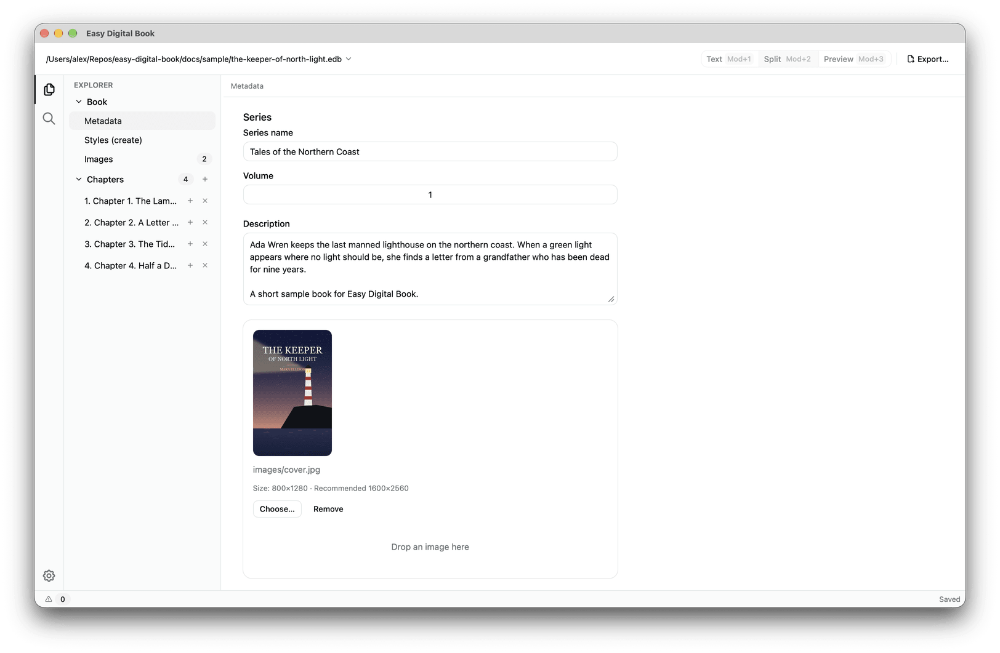
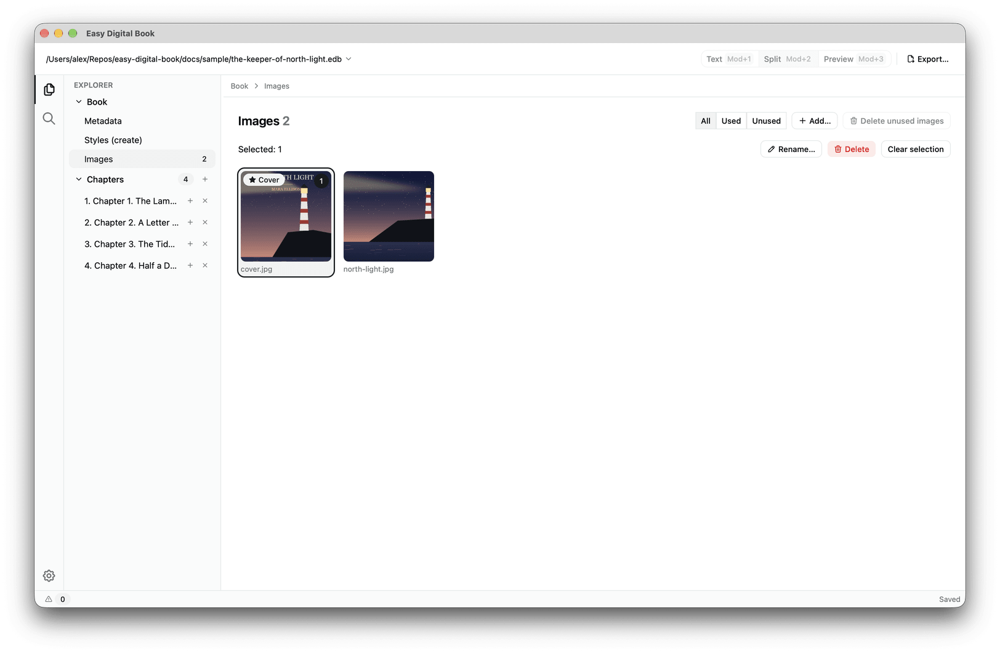
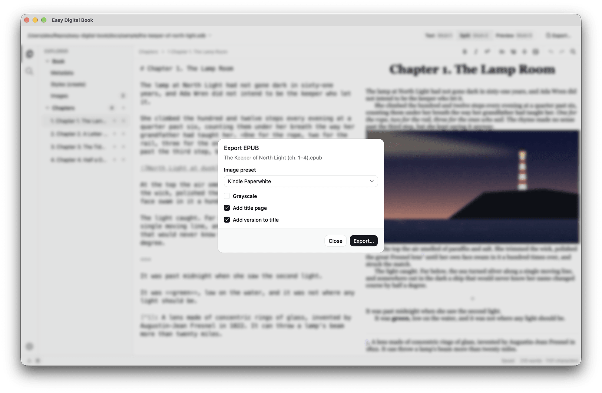
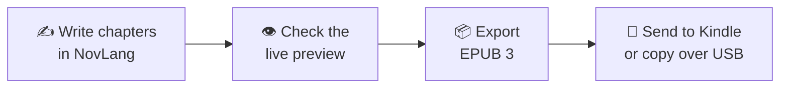

<div align="center">


# Easy Digital Book

### Write your novel. Get a Kindle-ready EPUB.

A calm, focused desktop editor that turns chapters of fiction into clean,
valid EPUB 3 books for Kindle Paperwhite — no Calibre round-trips, no Sigil
spelunking.

[](https://github.com/ImmortalAI/easy-digital-book/releases/latest)
[](https://github.com/ImmortalAI/easy-digital-book/releases)
[](https://github.com/ImmortalAI/easy-digital-book/actions/workflows/ci.yml)


[](LICENSE)

[**Download**](#download) · [**Features**](#features) · [**Markup**](#markup) · [**Shortcuts**](#shortcuts) · [**Roadmap**](#roadmap) · [**Contributing**](CONTRIBUTING.md)

<br />

<picture>
  <source media="(prefers-color-scheme: dark)" srcset="docs/assets/screenshots/editor-dark.png" />
  <source media="(prefers-color-scheme: light)" srcset="docs/assets/screenshots/editor-light.png" />
  
</picture>

</div>

<br />

<a id="features"></a>

## ✨ Features

<table>
  <tr>
    <td width="33%" valign="top">
      <h3>✍️ Distraction-free writing</h3>
      A proportional-font editor with soft wrap, spell checking in the book's
      language, and separate undo history for every chapter.
    </td>
    <td width="33%" valign="top">
      <h3>👁️ Live book preview</h3>
      See the page as the reader will: Text, Split and Preview modes, synced
      scrolling, the book's own styles, clickable footnotes.
    </td>
    <td width="33%" valign="top">
      <h3>📚 Built for long novels</h3>
      50 or 300 chapters — drag to reorder, navigate from the keyboard, and
      spot chapters with warnings at a glance.
    </td>
  </tr>
  <tr>
    <td width="33%" valign="top">
      <h3>🔎 Search the whole book</h3>
      Case, whole-word and regex search across every chapter, with a
      before → after preview and a single undo for “Replace all”.
    </td>
    <td width="33%" valign="top">
      <h3>🖼️ Images that just work</h3>
      Paste, drop or pick images; duplicates are detected; a gallery shows
      what is used, and renaming updates every reference.
    </td>
    <td width="33%" valign="top">
      <h3>📖 Kindle-ready export</h3>
      Valid EPUB 3 with a title page, table of contents, endnotes, series
      metadata, and images resized for the Paperwhite screen.
    </td>
  </tr>
  <tr>
    <td width="33%" valign="top">
      <h3>💾 Never lose a word</h3>
      Atomic saves, background autosave and crash recovery. One book is one
      portable <code>.edb</code> file.
    </td>
    <td width="33%" valign="top">
      <h3>🎨 Your styles, optional</h3>
      A Kindle-friendly theme out of the box, plus an optional
      <code>custom.css</code> that applies to both preview and export.
    </td>
    <td width="33%" valign="top">
      <h3>🌍 Speaks your language</h3>
      English, Русский and 简体中文 interface, light and dark themes that
      follow your system.
    </td>
  </tr>
</table>

## 📸 A closer look

<table>
  <tr>
    <td width="50%" valign="top">
      
      <p align="center"><b>Search & replace across the book</b><br /><sub>Results grouped by chapter, with a preview of every change.</sub></p>
    </td>
    <td width="50%" valign="top">
      
      <p align="center"><b>Metadata & cover</b><br /><sub>Authors, translators, series, description and cover in one form.</sub></p>
    </td>
  </tr>
  <tr>
    <td width="50%" valign="top">
      
      <p align="center"><b>Image gallery</b><br /><sub>Filter used and unused images, batch delete and rename.</sub></p>
    </td>
    <td width="50%" valign="top">
      
      <p align="center"><b>One-click export</b><br /><sub>Warnings summary, image preset, title page — then a ready EPUB.</sub></p>
    </td>
  </tr>
</table>

## 🚀 How it works



1. **Create a book** and write each chapter in NovLang, a tiny Markdown-like
   markup made for fiction.
2. **Fill in the metadata** — title, authors, series, cover.
3. **Export** an `.epub` and put it on your Kindle with
   [Send to Kindle](https://www.amazon.com/sendtokindle) or a USB cable.

> [!TIP]
> Want to look around first? Open the sample book
> [`docs/sample/the-keeper-of-north-light.edb`](docs/sample/the-keeper-of-north-light.edb)
> — it has a cover, an illustration, footnotes, a letter and a scene break.

<a id="markup"></a>

## 📝 Write in NovLang

No tags, no styling options to fiddle with — just the handful of things a
novel actually needs:

```text
# Chapter 2. A Letter Without a Stamp

There was no stamp and no address. Only her *name*, in faded ink.

> Ada,
>
> If you are reading this, the green light has come back.

Her grandfather had been dead for **nine years**[^1].

***


[^1]: He was buried, at his own request, facing the sea.
```

| You write           | You get                         |
| ------------------- | ------------------------------- |
| `# Title`           | Chapter heading (first line)    |
| `*text*` `**text**` | _Italic_ and **bold**           |
| `***` on its own    | A centred scene break           |
| `> text`            | A quote or a letter             |
| ``  | An illustration                 |
| `[^1]` + `[^1]: …`  | An endnote with links both ways |

Mistakes never block you: anything the parser does not understand stays as
plain text and shows up as a ⚠ warning you can click.

📖 **Full markup guide:** [English](docs/en/markup.md) ·
[Русский](docs/ru/markup.md) · [简体中文](docs/zh-CN/markup.md)

<a id="download"></a>

## 📥 Download

Grab the latest build for your system from
[**Releases**](https://github.com/ImmortalAI/easy-digital-book/releases/latest).

| Platform                 | File                          |
| ------------------------ | ----------------------------- |
| 🍎 macOS 12+ (Universal) | `.dmg`                        |
| 🪟 Windows 10+           | `-setup.exe`                  |
| 🐧 Linux (Ubuntu 22.04+) | `.AppImage`, `.deb` or `.rpm` |

> [!IMPORTANT]
> Builds are not code-signed yet, so the system will warn you on first launch.
>
> - **macOS:** open the app once, then go to **System Settings → Privacy &
>   Security** and click **Open Anyway**.
> - **Windows:** in the SmartScreen dialog, click **More info → Run anyway**.
>   Only do this for files downloaded from this repository's Releases page.

<a id="shortcuts"></a>

## ⌨️ Keyboard shortcuts

<details>
<summary><b>Show all shortcuts</b> <sub>(Mod is ⌘ on macOS, Ctrl on Windows and Linux)</sub></summary>
<br />

| Action                        | Shortcut                            |
| ----------------------------- | ----------------------------------- |
| New / Open / Save / Save as   | Mod+N / Mod+O / Mod+S / Mod+Shift+S |
| Bold / Italic                 | Mod+B / Mod+I                       |
| Insert footnote               | Mod+Alt+F                           |
| Text / Split / Preview        | Mod+1 / Mod+2 / Mod+3               |
| Show or hide the sidebar      | Mod+\\                              |
| Explorer / Search the book    | Mod+Shift+E / Mod+Shift+F           |
| Find & replace in the chapter | Mod+F                               |
| Preview: paper style on / off | Mod+Alt+P                           |
| Replace all in the book       | Mod+Alt+Enter                       |
| Move the selected chapter     | Alt+↑ / Alt+↓                       |

</details>

<a id="roadmap"></a>

## 🗺️ Roadmap

Planned after v1, in no particular order and with no dates yet:

- [ ] **AZW3 export.** Save a Kindle-native book directly, without
      converting the EPUB in Calibre.
- [ ] **Kindle CSS check.** Warn about rules in `custom.css` that Kindle
      ignores or renders differently.
- [ ] **Language check for English and Russian.** Catch spelling and wording
      mistakes in chapters beyond the system spell checker.

Ideas and votes are welcome in
[Issues](https://github.com/ImmortalAI/easy-digital-book/issues).

## 🛠️ Built with

[Tauri 2](https://tauri.app) · [Vue 3](https://vuejs.org) ·
[TypeScript](https://www.typescriptlang.org) ·
[CodeMirror 6](https://codemirror.net) ·
[Tailwind CSS 4](https://tailwindcss.com) ·
[shadcn-vue](https://www.shadcn-vue.com) ·
[novlang-js](https://www.npmjs.com/package/novlang-js)

The EPUB builder is validated with
[epubcheck](https://github.com/w3c/epubcheck) in CI on every change.

## 🤝 Contributing

Bug reports and pull requests are welcome. Setup, tests and the release
process are described in [CONTRIBUTING.md](CONTRIBUTING.md); changes are
listed in the [CHANGELOG](CHANGELOG.md).

## 📄 License

Easy Digital Book is free software, released under the
[GNU General Public License v3.0 or later](LICENSE). You may use, study, change
and share it; if you distribute a modified version, you must share its source
code under the same license.

<div align="center">
<br />
<sub>Made for readers who would rather read than convert.</sub>
</div>
